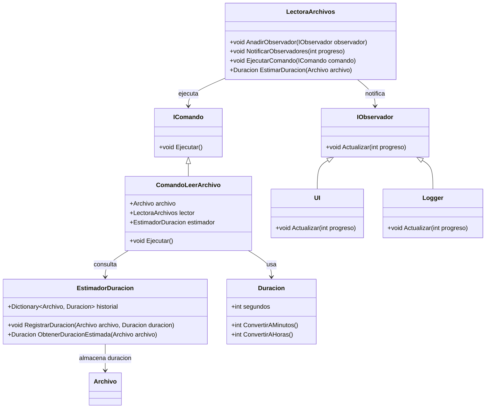

# Diseño y Evolución de Arquitecturas de Software

## Trabajo Práctico 2

Escenario elegido: Predicción de duración de tarea
La problemática consiste en lanzar una tarea que sea repetitiva (es decir, que se ha realizado en oportunidades anteriores) y producir un indicador de duración estimada de la tarea que sea visible para el usuario.

Criterios de aceptación
La duración estimada debe actualizarse a medida que transcurre el tiempo y se avanza la tarea.
La duración estimada puede calcularse en base a datos históricos locales de ejecución de la tarea.
En el escenario de ejecución en el que no se cuenta con datos históricos, esto debe comunicarse en forma transparente al usuario.

Simulación de tarea: Scan de virus archivos del disco local

## Diseño

## ADR 

Directorio docs/ 

## Ejecución del proyecto

Instalar SDK Net Core 8 descargando el instalador desde https://aka.ms/dotnet/download
verificar si se intaló correctamente ejecutando en consola 
dotnet --list-sdks
En la lista debe figurar "8.0.403 [C:\PROGRAM FILES\DOTNET\sdk]" o version posterior

Instalar Herramientas:
dotnet add package Microsoft.EntityFrameworkCore.Tools 
Ejecutar el comando para que genere las tablas: Update-Database -StartUpProject App -Project Repository -Context ApplicationContext
Si falla, parados en .\deas-tp2\scanner el siguiente comando
 dotnet ef Database Update --startup-project App --project Repository --context ApplicationContext

Este comando se usa para crear nuevas migrations frentea cambios en el modelo de bases de datos:
Add-Migration <Migrationname> -StartUpProject App -Project Repository -Context ApplicationContext

El nombre de cada migration, debe ser único. 
Cada nueva entidad que se agrege al modelo, debe sumarse también a la clase ApplicationContext como una nueva property:
 public DbSet<NewEntity> NewEntity { get; set; }
